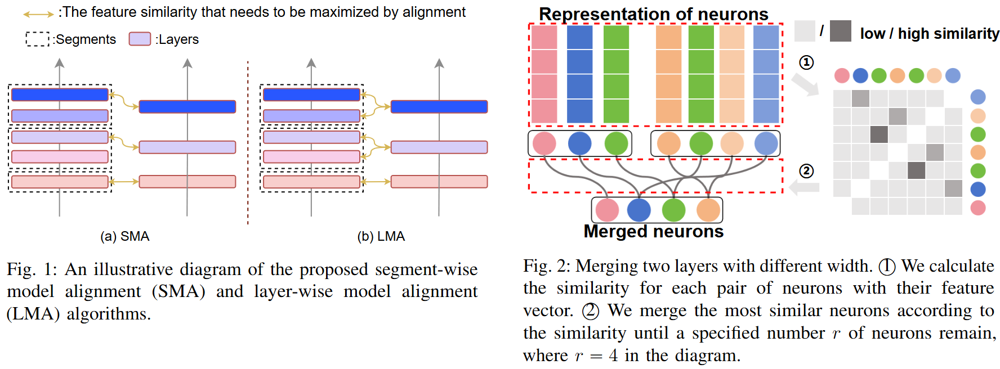
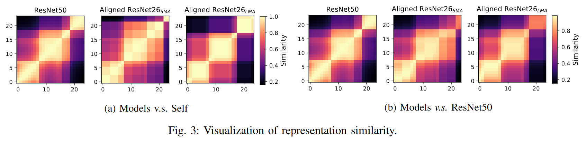

# Training-free Heterogeneous Model Merging

This repository is the implementation of the paper Training-free Heterogeneous Model Merging.

## Overview

Model merging has attracted significant attention as a powerful paradigm for model reuse, facilitating the integration of task-specific models into a singular, versatile framework endowed with multifarious capabilities. Previous studies, predominantly utilizing methods such as Weight Average (WA), have shown that model merging can effectively leverage pretrained models without the need for laborious retraining. However, the inherent heterogeneity among models poses a substantial constraint on its applicability, particularly when confronted with discrepancies in model architectures. To overcome this challenge, we propose an innovative model merging framework designed for heterogeneous models, encompassing both depth and width heterogeneity. To address depth heterogeneity, we introduce a layer alignment strategy that harmonizes model layers by segmenting deeper models, treating consecutive layers with similar representations as a cohesive segment, thus enabling the seamless merging of models with differing layer depths. For width heterogeneity, we propose a novel elastic neuron zipping algorithm that projects the weights from models of varying widths onto a common dimensional space, eliminating the need for identical widths. Extensive experiments validate the efficacy of these proposed methods, demonstrating that the merging of structurally heterogeneous models can achieve performance levels comparable to those of homogeneous merging, across both vision and NLP tasks. 





## Dependencies

Our code is implemented and tested on PyTorch. Following packages are used:

```shell
tqdm
matplotlib
pandas
pyyaml
scikit-learn
fvcore
einops
easydict
networkx
scikit-image
opencv-python==4.6.0.66
thop
ptflops
timm==0.9.2
numba==0.57.1
seaborn
pytorch-nlp
# pygraphviz
clip @ git+https://github.com/openai/CLIP.git@d50d76daa670286dd6cacf3bcd80b5e4823fc8e1
```

You can install pytorch with following command:

```shell
pip install torch==1.12.1+cu116 torchvision==0.13.1+cu116 torchaudio==0.12.1 --extra-index-url https://download.pytorch.org/whl/cu116
```

Then, install the rest of dependencies:

```shell
pip install -r requirements.txt
```

## Data

3 datasets were used in this experiment:

- CIFAR-10: Automatic download with torchvision
- CIFAR-100: Automatic download with torchvision
- ImageNet: Downloadable from https://image-net.org/download.php

## Run

### Depth-heterogeneous merging

**Training models** 

```shell
python -m training_script.cifar_resnet26 --gpu=0
python -m training_script.cifar_resnet50 --gpu=0
python -m training_script.cifar5_vgg13 --gpu=0
python -m training_script.cifar5_vgg19 --gpu=0
```

**Evaluating merging methods**  

- Evaluating the merging method

```shell
python vgg_fusion_merging_auto.py --config-name=cifar5_vgg19 --config-name-b=cifar5_vgg13 --suffix=$SUFFIX --gpu=0
python resnet_fusion_merging_auto.py --config-name=cifar_resnet50 --config-name-b=cifar_resnet26 --suffix=$SUFFIX --gpu=0
```

- `$SUFFIX` can be:

  > _perm: use alignment-based neuron matching, otherwise zipping-based
  >
  > _smaalign: use segment-wise model alignment
  >
  > _lmaalign: use layer-wise model alignment

### Width-heterogeneous merging

**Training models** 

```shell
python -m training_script.cifar_resnet26 --gpu=0
python -m training_script.cifar_resnet50 --gpu=0
python -m training_script.cifar_resnet26 -w=4 --gpu=0
python -m training_script.cifar_resnet50 -w=4 --gpu=0
python -m training_script.cifar_resnet26 -w=16 --gpu=0
python -m training_script.cifar_resnet50 -w=16 --gpu=0
```

**Evaluating merging methods**  

- Evaluating the merging method

```shell
python resnet_fusion_merging_auto.py --config-name=cifar50_resnet26 --config-name-b=cifar50_resnet26x4 --gpu=0
python resnet_fusion_merging_auto.py --config-name=cifar50_resnet50x16 --config-name-b=cifar50_resnet50 --gpu=0
```

### Visualization Analysis of Depth Alignment

reference to `vis_hetero_align.ipynb`